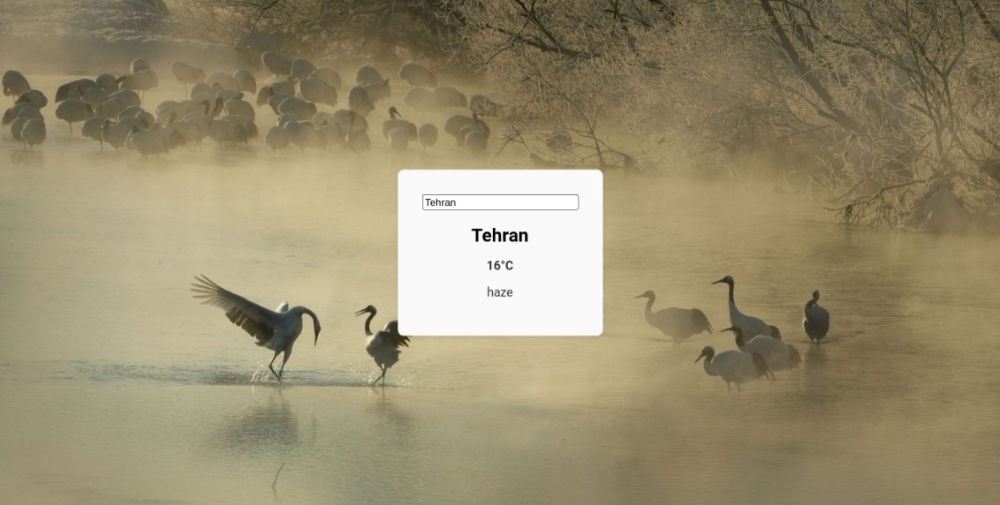

# Weather App React Demo

This repository contains a simple React application that fetches and
displays weather information using the OpenWeatherMap API. The app
showcases how to make asynchronous requests to external APIs and handle
the response data within a React component.

## Features

- Fetches current weather data based on user input (city name)
- Displays weather details such as temperature, humidity, wind speed, etc.
- Responsive design for mobile and desktop devices
- Error handling for invalid city names or API errors

## Demo

A live demo of the application is available at [GitHub Pages URL].

## Screenshots



## Installation

To run the application locally, follow these steps:

1. Clone the repository:
   ```
   git clone https://github.com/yourusername/weather-app-react.git
   ```
2. Navigate into the project directory:
   ```
   cd weather-app-react
   ```
3. Install dependencies:
   ```
   npm install
   ```
4. Start the development server:
   ```
   npm start
   ```
5. Open `http://localhost:3000` in your browser to view the application.

## Usage

After starting the application, enter a city name in the search bar and
press Enter. The app will display the current weather information for
that location.

## API Key

The application uses the OpenWeatherMap API to fetch weather data. To
use the app, you need to obtain an API key from OpenWeatherMap:

1. Sign up for a free account at [OpenWeatherMap](https://home.openweathermap.org/users/sign_up).
2. Obtain your API key from the dashboard.
3. Create a `.env` file in the root of the project and add your API key like so:
   ```
   REACT_APP_OPENWEATHERMAP_API_KEY=your_api_key_here
   ```

**Note:** Do not commit your `.env` file to public repositories. Add
`.env` to your `.gitignore` file to prevent accidental commits.

## Contributing

Contributions are welcome! Please feel free to submit pull requests or
open issues if you find any bugs or have suggestions for improvements.


# Setup development env with dokcer

1. **Install Docker**: If you haven't already, install Docker Desktop on
   your machine. It includes both Docker Engine and Docker Compose,
   which will be useful for managing multi-container applications.

2. **Create a Dockerfile**: In the root directory of your React project,
   create a file named `Dockerfile`. This file will contain instructions
   for building a Docker image of your application.

3. **Define the Dockerfile**: Open the Dockerfile in a text editor and
   add the following content:

```Dockerfile
## Use an official Node runtime as the base image
FROM node:14

## Set the working directory in the container to /app
WORKDIR /app

## Copy package.json and package-lock.json into the working directory
COPY package*.json ./

## Install any needed packages specified in package.json
RUN npm install

## Bundle app source inside Docker image
COPY . .

## Make port  3000 available to the world outside this container
EXPOSE  3000


## Define the command to run your app using CMD which defines your runtime
CMD ["npm", "start"]
```

This Dockerfile starts with a Node.js base image, sets the working
directory, copies over your `package.json` and `package-lock.json`,
installs your dependencies, copies the rest of your code, exposes port
3000 (the default port for React apps), and finally runs `npm start` to
start your application.

4. **Build the Docker Image**: Run the following command in your
   terminal from the same directory as your Dockerfile:

```sh
docker build -t my-react-app .
```

Replace `my-react-app` with whatever name you want to give your Docker
image.

5. **Run the Docker Container**: After the image is built, you can run
   it with the following command:

```sh
docker run -p  3000:3000 -v ${PWD}:/app -e CHOKIDAR_USEPOLLING=true my-react-app
```

This command maps port  3000 inside the container to port  3000 on your
host machine, mounts your current directory (`${PWD}`) to `/app` inside
the container, and sets an environment variable that helps with hot
reloading when files change.

6. **Access Your Application**: Open your web browser and navigate to
   `http://localhost:3000`. You should see your React application
   running.

Remember that every time you make changes to your application, you may
need to rebuild the Docker image if you've made changes to the
Dockerfile or installed new dependencies. However, since we're using
volume mapping, your local changes will still reflect in the container
without rebuilding the image.

# Build and run

To build it run the follwoing command:
```bash
docker build -t weather-app:v1 .
```

To run it use this:
```bash
docker run --rm -p  3000:3000 -v ${PWD}:/app -e CHOKIDAR_USEPOLLING=true weather-app:v1
```

# Code Explaination

## React Component (`App.js`)

```jsx
// App.js
import React from 'react';
import './App.css'; // Import the CSS file
import Weather from './Weather'; // Assuming Weather is your weather component

function App() {
  return (
    <div className="App">
      <Weather />
    </div>
  );
}

export default App;
```

- `import React from 'react'`: This line imports the React library, which is necessary for writing JSX and creating React components.
- `import './App.css'`: This line imports the CSS file we created earlier. By importing it here, the styles defined in `App.css` will be applied globally to the entire application.
- `import Weather from './Weather'`: This line imports the `Weather` component from a file named `Weather.js`. This assumes that you have a separate file where you define your `Weather` component.
- `function App()`: This defines a functional React component named `App`. This is typically the root component of your React application.
- `return (...)`: Inside the `App` function, we return the JSX that defines what should be rendered by this component. In this case, we render a `div` with the class name "App" and inside it, we render the `Weather` component.
- `export default App`: This line exports the `App` component so that it can be imported and used in other parts of your application, such as in the entry point file where you call `ReactDOM.render()`.

When you run your React application, the `App` component will be mounted to the DOM, and because of the imported CSS, the background image will be displayed on the entire page. The `Weather` component will also be rendered within the `App` component, allowing users to view weather information.

## Weather component

```jsx
import React, { useState, useEffect } from 'react';
import axios from 'axios';

const Weather = () => {
  const [weatherData, setWeatherData] = useState(null);
  const apiKey = 'your_openweathermap_api_key'; // Replace with your actual OpenWeatherMap API key
  const cityName = 'London'; // Replace with the city you want to get weather for

  useEffect(() => {
    const fetchWeather = async () => {
      try {
        const response = await axios.get(`http://api.openweathermap.org/data/2.5/weather?q=${cityName}&appid=${apiKey}`);
        setWeatherData(response.data);
      } catch (error) {
        console.error('Error fetching weather data', error);
      }
    };

    fetchWeather();
  }, []);

  return (
    <div>
      {weatherData ? (
        <>
          <h2>{weatherData.name}</h2>
          <p>Temperature: {weatherData.main.temp} K</p>
          <p>Humidity: {weatherData.main.humidity}%</p>
          <p>Weather: {weatherData.weather[0].description}</p>
        </>
      ) : (
        <p>Loading...</p>
      )}
    </div>
  );
};

export default Weather;
```

### Imports

- `import React, { useState, useEffect } from 'react'`: This line imports the `React` object, along with two hooks: `useState` and `useEffect`. `useState` allows us to add state to our functional component, and `useEffect` lets us perform side effects, such as data fetching.
- `import axios from 'axios'`: This line imports the `axios` library, which is a promise-based HTTP client for making asynchronous requests.

### State Initialization

- `const [weatherData, setWeatherData] = useState(null);`: This line initializes a piece of state called `weatherData` with an initial value of `null`. `setWeatherData` is the function we'll use to update this state later.

### API Key and City Name

- `const apiKey = 'your_openweathermap_api_key';`: This constant holds the API key for the OpenWeatherMap service. You should replace `'your_openweathermap_api_key'` with your actual API key obtained from OpenWeatherMap.
- `const cityName = 'London';`: This constant holds the name of the city for which we want to fetch weather data. You can change `'London'` to any city you wish to get weather information for.

### useEffect Hook

- `useEffect(() => { ... }, []);`: The `useEffect` hook is used to perform side effects in functional components. The empty array `[]` passed as the second argument means that the effect will only run once after the initial render of the component.

### Fetching Weather Data

- Inside the `useEffect` hook, we define an asynchronous function `fetchWeather` that makes an HTTP GET request to the OpenWeatherMap API using `axios`.
- The URL includes query parameters for the city name and the API key.
- If the request is successful, the response data is saved to the `weatherData` state using `setWeatherData`.
- If there's an error during the request, it's logged to the console.

### Rendering Weather Data

- The `return` statement defines what the component renders. It returns a `div` containing either the weather data or a loading message.
- `{weatherData ? (...) : (<p>Loading...</p>)}`: This is a conditional rendering based on whether `weatherData` is truthy (i.e., not `null`).
- If `weatherData` exists, it displays the city name, temperature, humidity, and weather description.
- If `weatherData` does not exist (i.e., it's still `null`), it displays "Loading..." until the data is fetched.

### Exporting the Component

- `export default Weather;`: This line exports the `Weather` component so that it can be imported and used in other parts of the application.

This `Weather` component is a simple example of a React component that interacts with an external API to fetch and display data. It demonstrates the use of React hooks for managing state and side effects, as well as conditional rendering based on the presence of data.

## Weather CSS

### Global Styles for the Body Element

```css
body {
  background-image: url(https://bing.biturl.top/?resolution=1920&format=image&index=0&mkt=zh-CN);
  height:  100vh;
  width:  100%;
  background-size: cover;
  background-position: center;
  background-repeat: no-repeat;
}
```

- `background-image: url(...)`: This property sets the background image of the `<body>` element to an image retrieved from a URL. The URL appears to be a dynamic link to Bing's Image of the Day service, possibly returning a high-resolution image suitable for a desktop background.
- `height:  100vh;`: This sets the height of the `<body>` element to  100% of the viewport height (`vh`). This ensures that the background image covers the full height of the screen.
- `width:  100%;`: This sets the width of the `<body>` element to  100% of its parent element, which is the `<html>` element. Since the `<html>` element takes up the full width of the browser window, this effectively makes the `<body>` element span the full width of the window.
- `background-size: cover;`: This property scales the background image to be as large as possible so that the background area is completely covered by the image. Some parts of the image may not be in view within the background positioning area.
- `background-position: center;`: This property centers the background image within the `<body>` element. It helps to maintain the aspect ratio of the image while covering the entire body.
- `background-repeat: no-repeat;`: This property prevents the background image from repeating across the body. Without this, the image would tile across the entire body, which is usually not desired for a background image.

### Styles for the Weather Container

```css
.weather-container {
  text-align: center;
  padding:   2rem;
  background-color: #f9f9f9;
  border-radius:   8px;
  box-shadow:   0   2px   4px rgba(0,   0,   0,   0.1);
  display: table-cell;
  position: absolute;
  top:  50%;
  left:  50%;
  transform: translate(-50%, -50%);
}
```

- `text-align: center;`: This property aligns the text within the `.weather-container` to the center.
- `padding:   2rem;`: This adds space around the content inside the `.weather-container`, providing some breathing room around the edges.
- `background-color: #f9f9f9;`: This sets the background color of the `.weather-container` to a light gray (`#f9f9f9`).
- `border-radius:   8px;`: This rounds the corners of the `.weather-container` with a radius of   8 pixels, giving it a slightly rounded appearance.
- `box-shadow:   0   2px   4px rgba(0,   0,   0,   0.1);`: This adds a subtle shadow below the `.weather-container` to give it a lifted appearance. The shadow is offset by   2 pixels vertically and   4 pixels horizontally, with a blur radius of   4 pixels and a black color with   10% opacity.
- `display: table-cell;`: This property changes the display type of the `.weather-container` to behave like a table cell, which can be useful for vertical alignment purposes.
- `position: absolute;`: This property positions the `.weather-container` relative to the nearest positioned ancestor (instead of relative to the viewport). If no positioned ancestors exist, it uses the document body, and moves along with page scrolling.
- `top:  50%;`: This positions the `.weather-container` halfway down the page from the top edge of its containing block.
- `left:  50%;`: This positions the `.weather-container` halfway across the page from the left edge of its containing block.
- `transform: translate(-50%, -50%);`: This property applies a  2D transformation to the `.weather-container`, moving it up and to the left by  50% of its own width and height. This combination of absolute positioning and translation is a common technique to center an absolutely positioned element both vertically and horizontally.

### Styles for the Weather Title

```css
.weather-title {
  font-size:   1.5rem;
  margin-bottom:   1rem;
}
```

- `font-size:   1.5rem;`: This sets the font size of the `.weather-title` to   1.5 rem units, which is larger than the base font size.
- `margin-bottom:   1rem;`: This adds space below the `.weather-title`, separating it from any content that follows it.

### Styles for the Weather Details

```css
.weather-details {
  font-size:   1rem;
  color: #333;
}
```

- `font-size:   1rem;`: This sets the font size of the `.weather-details` to   1 rem units, which is the base font size for most browsers.
- `color: #333;`: This sets the text color of the `.weather-details` to a dark gray (`#333`).

These styles together create a visually appealing layout for displaying weather information, with a centered card that contains the title and details of the weather, and a full-screen background image.

